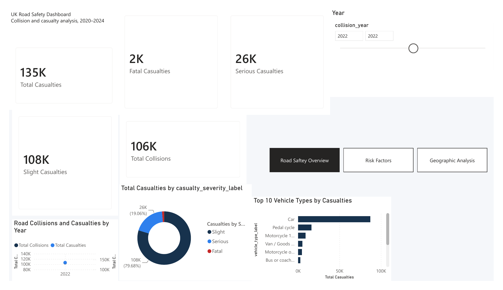
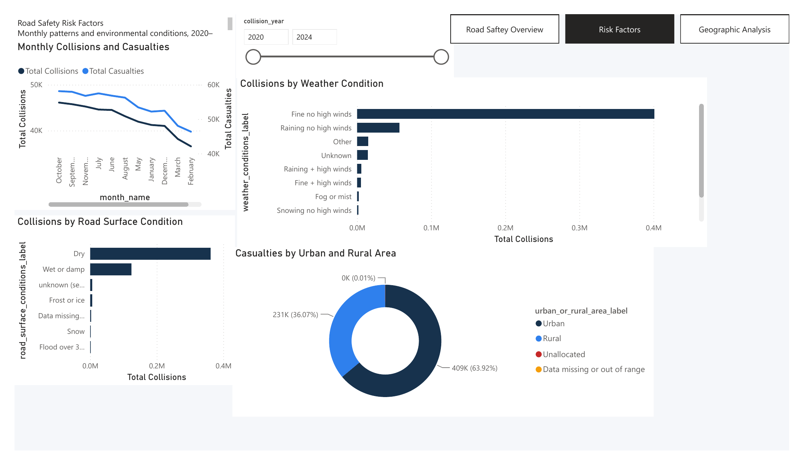
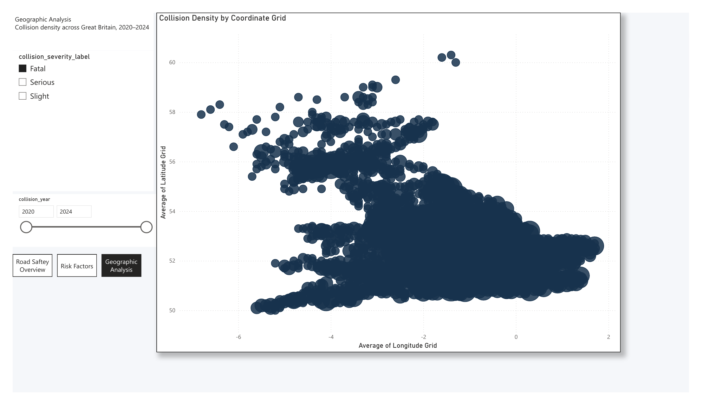
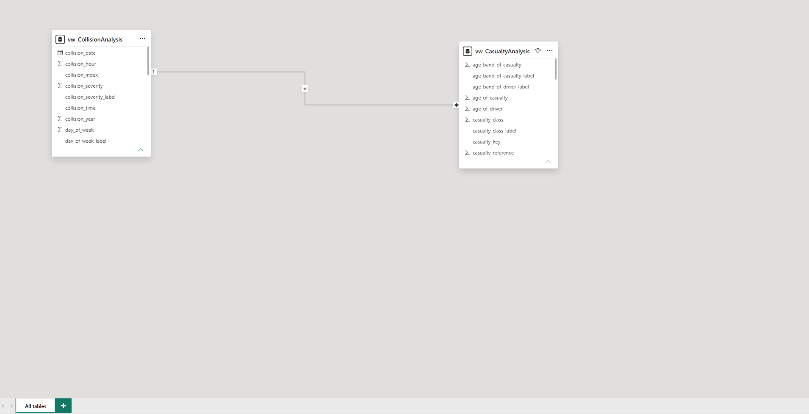

# UK Road Safety Dashboard

An end-to-end data analytics project that turns five years of UK road-safety records into decision-ready reporting for road-safety and operations stakeholders.

The project combines Python data preparation, SQL Server data engineering, relational modeling, reporting views, DAX measures, and a multi-page Power BI dashboard. It demonstrates the complete workflow from raw data validation to business recommendations—not just dashboard design.

## Dashboard Export

[View the exported Power BI dashboard PDF](dashboard/exports/road_accident_dashboard.pdf)

[View the project overview](docs/road_accident_dashboard_case_study.pdf)

## Dashboard Preview

### Road Safety Overview



### Risk Factors



### Geographic Analysis



### Power BI Data Model



## Project Summary

The analytical database contains:

- **503,475 collisions**
- **640,522 casualties**
- **920,692 vehicles**
- Records covering **2020–2024**

The Power BI report contains three dashboard pages:

1. **Road Safety Overview** — headline KPIs, casualty severity, annual trends, and vehicle-type analysis
2. **Risk Factors** — monthly patterns, weather conditions, road-surface conditions, and urban/rural casualty distribution
3. **Geographic Analysis** — collision-density mapping across Great Britain using latitude and longitude grid values

## Business Questions

This project was designed to answer practical road-safety questions such as:

- How many collisions and casualties were reported from 2020–2024?
- How are casualties distributed across fatal, serious, and slight severity levels?
- Which vehicle types are associated with the highest casualty counts?
- How do collisions and casualties vary by month and year?
- Which weather and road-surface conditions appear most often in reported collisions?
- Are casualties more concentrated in urban or rural areas?
- Where are collision records geographically concentrated across Great Britain?

## Key Findings

- **2022 recorded the highest collision count** in the five-year period.
- **Slight injuries made up the largest share of casualties**, followed by serious and fatal casualties.
- **Cars were associated with the highest casualty counts** among vehicle categories.
- **Fine weather with no high winds** was the most common recorded weather condition for collisions.
- **Dry road surfaces** were the most common recorded road-surface condition.
- **Urban areas represented the largest casualty share**, with rural areas making up a smaller but still significant share.
- The geographic page shows collision concentrations across Great Britain using rounded coordinate-grid values.

## Data Pipeline

```text
UK road safety CSV files
        |
        v
Python inspection, validation, lookup extraction, and cleaning
        |
        v
SQL Server staging tables
        |
        v
Typed relational tables with primary keys and foreign keys
        |
        v
Indexes and analytical reporting views
        |
        v
Power BI data model, DAX measures, and dashboard pages
```

## Database Design

The SQL Server database uses three primary analytical entities:

- `dbo.Collisions` — one row per collision
- `dbo.Vehicles` — one row per vehicle
- `dbo.Casualties` — one row per casualty

Relationships:

```text
dbo.Collisions  1 ───── *  dbo.Vehicles
dbo.Collisions  1 ───── *  dbo.Casualties
dbo.Vehicles    1 ───── *  dbo.Casualties
```

Power BI uses reporting views for dashboard analysis:

```text
vw_CollisionAnalysis  1 ───── *  vw_CasualtyAnalysis
```

This structure allows collision-level filters such as year, severity, weather, road type, and location to filter casualty-level measures while avoiding unnecessary many-to-many relationships in the Power BI model.

## SQL Workflow

The SQL scripts are organized in execution order:

| Script | Purpose |
|---|---|
| `01_create_tables.sql` | Creates staging and typed database tables |
| `02_correct_collisions_staging.sql` | Aligns the collision staging-table order with the CSV |
| `03_bulk_import_staging.sql` | Loads cleaned CSV files into staging tables |
| `04_validate_staging.sql` | Validates row counts, unique keys, and missing keys |
| `05_load_typed_tables.sql` | Converts staging text into typed relational tables |
| `06_validate_typed_tables.sql` | Validates conversions and table relationships |
| `07_create_relationships_indexes.sql` | Creates foreign keys and performance indexes |
| `08_create_reporting_views.sql` | Creates collision-, casualty-, and vehicle-grain views |
| `09_create_dashboard_summary_views.sql` | Creates reusable summary views for analysis |

## Data Quality Checks

Validation steps were included before dashboard development to reduce reporting errors:

- Confirmed **503,475 distinct collision records**
- Confirmed **640,522 distinct casualty records**
- Confirmed **920,692 distinct vehicle records**
- Verified **0 duplicate collision keys**
- Verified **0 duplicate casualty keys**
- Verified **0 duplicate vehicle keys**
- Verified **0 casualties without matching collision records**
- Verified **0 vehicles without matching collision records**
- Reconciled reported casualty and vehicle totals against source table row counts

## Dashboard Measures

Core DAX measures include:

```DAX
Total Collisions =
COUNTROWS('vw_CollisionAnalysis')
```

```DAX
Total Casualties =
COUNTROWS('vw_CasualtyAnalysis')
```

```DAX
Fatal Casualties =
CALCULATE(
    [Total Casualties],
    'vw_CasualtyAnalysis'[casualty_severity_label] = "Fatal"
)
```

```DAX
Casualties per Collision =
DIVIDE(
    [Total Casualties],
    [Total Collisions],
    0
)
```

Additional measures calculate serious casualties, slight casualties, and other dashboard KPIs used in the Power BI report.

## Tools and Technologies

- **Python:** pandas, Jupyter, openpyxl
- **Database:** Microsoft SQL Server
- **SQL Development:** SQL Server Management Studio
- **Visualization:** Microsoft Power BI Desktop
- **Version Control:** Git and GitHub
- **Development Environments:** openSUSE Tumbleweed and Windows 11 virtual machine
- **Data Formats:** CSV, SQL, PBIX, PDF, PNG, and Markdown

## Repository Structure

```text
road-accident-dashboard/
├── dashboard/
│   ├── exports/
│   │   └── road_accident_dashboard.pdf
│   └── screenshots/
│       ├── 01_road_safety_overview.png
│       ├── 02_risk_factors.png
│       ├── 03_geographic_analysis.png
│       └── 04_data_model.png
├── data/
│   ├── processed/
│   └── raw/
├── docs/
├── notebooks/
│   └── 01_data_exploration.ipynb
├── sql/
│   ├── 01_create_tables.sql
│   ├── 02_correct_collisions_staging.sql
│   ├── 03_bulk_import_staging.sql
│   ├── 04_validate_staging.sql
│   ├── 05_load_typed_tables.sql
│   ├── 06_validate_typed_tables.sql
│   ├── 07_create_relationships_indexes.sql
│   ├── 08_create_reporting_views.sql
│   └── 09_create_dashboard_summary_views.sql
├── src/
│   ├── extract_lookup_tables.py
│   ├── inspect_data.py
│   ├── inspect_data_guide.py
│   ├── prepare_data.py
│   └── validate_data.py
├── .gitignore
├── README.md
└── requirements.txt
```

## Reproducing the Project

1. Obtain the UK road safety collision, casualty, vehicle, and data-guide files for 2020–2024.
2. Place the source files in `data/raw/`.
3. Create and activate a Python virtual environment.
4. Install the packages in `requirements.txt`.
5. Run the Python inspection, lookup extraction, validation, and preparation scripts.
6. Create `RoadAccidentDB` in SQL Server.
7. Run the scripts in `sql/` in numeric order.
8. Open Power BI Desktop and connect to the SQL Server reporting views.
9. Refresh or recreate the Power BI data model and dashboard visuals.

The large raw and processed CSV/Parquet files are intentionally excluded from version control.

## Limitations and Future Improvements

- The exported PDF reflects the dashboard filter state at export time.
- The geographic page uses rounded coordinate grids instead of an online map layer.
- Unknown, missing, unallocated, and out-of-range categories are preserved to avoid hiding source-data quality issues.
- Future improvements could include a dedicated date dimension, additional DAX time-intelligence measures, cleaner dashboard screenshots from Power BI Service, and a true map or heat-map layer for geographic density.

## Deliverables

- Exported Power BI dashboard PDF
- Dashboard preview images
- SQL Server data model and reporting views
- Python preparation and validation scripts
- Documented data-quality checks and analytical findings

## Author

**Pavanraj Parthiban**  
Data Analytics Portfolio Project
